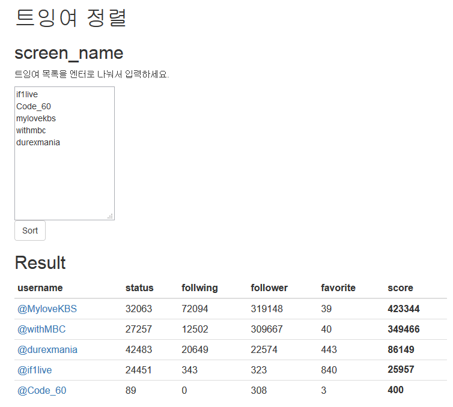

# twitter user sort
트잉여 정렬. 
트윗, 팔로잉, 팔로워, 관심글 수를 이용해서 누가 가장 트잉여인지 정렬하는 웹서비스입니다. 
사용한 프레임웍 : [importd](https://github.com/amitu/importd)

**[Demo](http://twitter-user-sort.herokuapp.com/)**



https://twitter.com/Code_60/status/582135263511461889

정렬도 관심없고 시각화도 관심없고 단지 뻘짓을 하고 싶어서 뭔가 어긋난 컨셉으로 importd 샘플을 작성했다.

## Install & Run
```
virtualenv .venv
. ./.venv/bin/activate
pip install -r requirements.txt
cp config.py.sample config.py
vim config.py
# 적절히 수정
./main.py runserver_plus 0.0.0.0:8000
```
